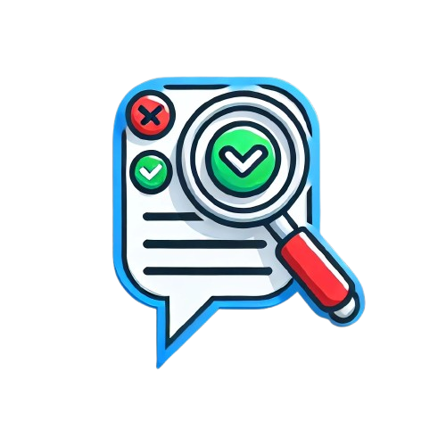

# 🗳️ Welcome to Fact or Cap!


> [!IMPORTANT]
> created as a program to detect false information. name is used as inspiration from an online trend. "Fact or Cap", the segfaulters have no direct association to those trends, we have usedc the name as a parody.

> A HackED Hackathon Project Created by *Saaim Japanwala, Kavin Kumaran, Nabeel Khan*

## 🚪 Introduction

Have you ever been reading an article about cats, just minding your own business, when suddenly you come across a bold, shocking claim like, “Cats can communicate telepathically with aliens”?

Now you’re at a crossroads. Should you continue reading and let this bizarre claim sit in your brain like a cat fur ball, or should you take action? 🤔

Luckily, there’s a superhero tool for moments like these—*Fact or Cap, THe Truth Checking Extention!*

With a single click, it’ll whisk you away to the trusted corners of the internet, where real, factual evidence reigns supreme. You can verify whether or not your feline friend is secretly working with extraterrestrials or if this is just another case of “misleading clickbait” from an overzealous cat blogger.

## 👀 Why?

We firmly believe that the internet is an incredible place to explore, learn, and expand your mind. But let’s be real—it’s also a breeding ground for misinformation and clickbait headlines designed to send you into a tailspin of unnecessary panic. It’s like a wild jungle out there, and sometimes the truth gets lost in the chaos.

## 🧰 How Does It Work?


 
> [Watch More Demos Here](documentation/README.md)


Utilizing the Google Fact Checking API, the Fact or Cap Chrome extension serves to accurately verify any highlighted piece of information found online. It's ease of use renders it a useful companion whilst browsing the internet, as simply highlighting a chosen text prompts open the Fact or Cap Chrome extension!


# 📖 Fact Checker Chrome Extension

A Chrome extension that allows users to highlight any sentence on the internet, right-click, and fact-check the selected text instantly using verified sources.

## 🚀 Features
- Highlight any text on a webpage and verify its accuracy.
- Right-click to open the extension and run a fact-check.
- Provides results with reliable sources for validation.
- Lightweight and easy to use.

## 🛠 Installation

Follow these steps to install the extension manually:

1. **Clone the repository**:
   ```sh
   git clone https://github.com/Segmentation-Faulters-HackED-2025/fact-or-cap.git
   cd fact-or-cap
   ```

2. **Open Chrome and go to Extensions page**:
   - Navigate to `chrome://extensions/`
   - Enable **Developer Mode** (toggle at the top-right corner)

3. **Load the extension**:
   - Click **Load unpacked**
   - Select the cloned repository folder

4. **Start Fact-Checking!**
   - Highlight any text on a webpage, right-click, and select **"Fact-Check This"**
   - The extension will analyze the text and provide results.

## 📝 Usage
1. Open any webpage.
2. Highlight a sentence or phrase you want to fact-check.
3. Right-click and select **"Is This Fact or Cap?"** from the context menu.
4. The extension popup will open with the highlighted text.
5. View results, including reliability scores and source links.

## 🏗 Future Enhancements
- Integrate with fact-checking APIs.
- Provide credibility scores and related articles.
- Add a history of checked statements.

## 🤝 Contributing
Feel free to open issues and submit pull requests to improve the extension.

## 📜 License
This project is licensed under the [MIT License](LICENSE).

---
Made with ❤️ by *The Segfaulters*


